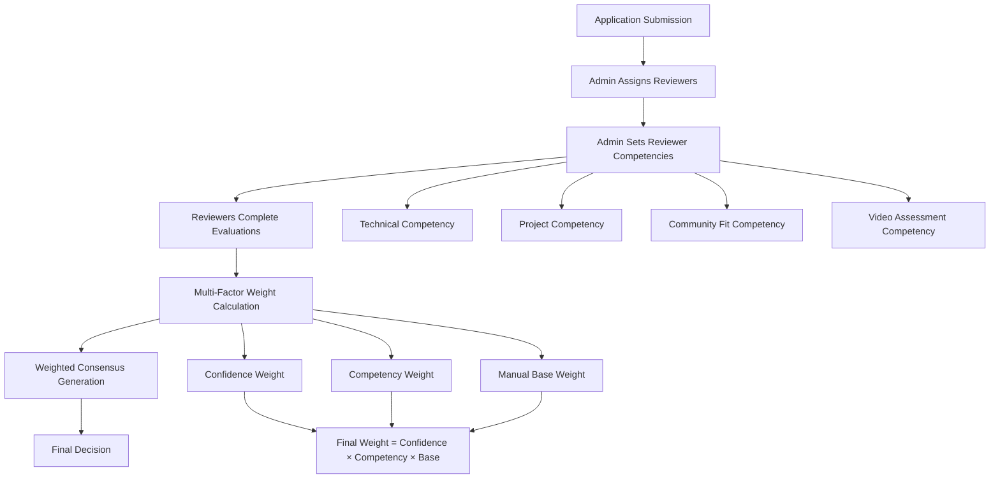
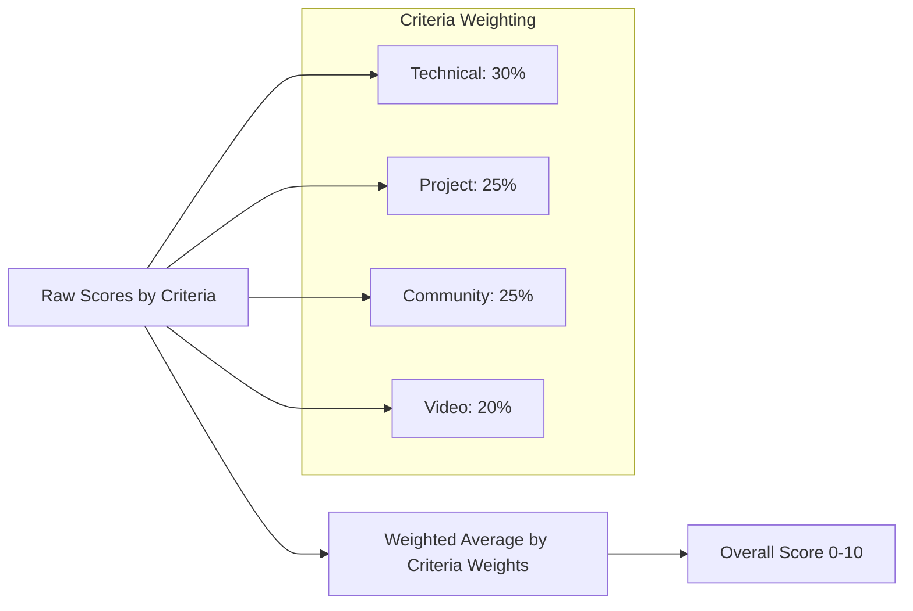
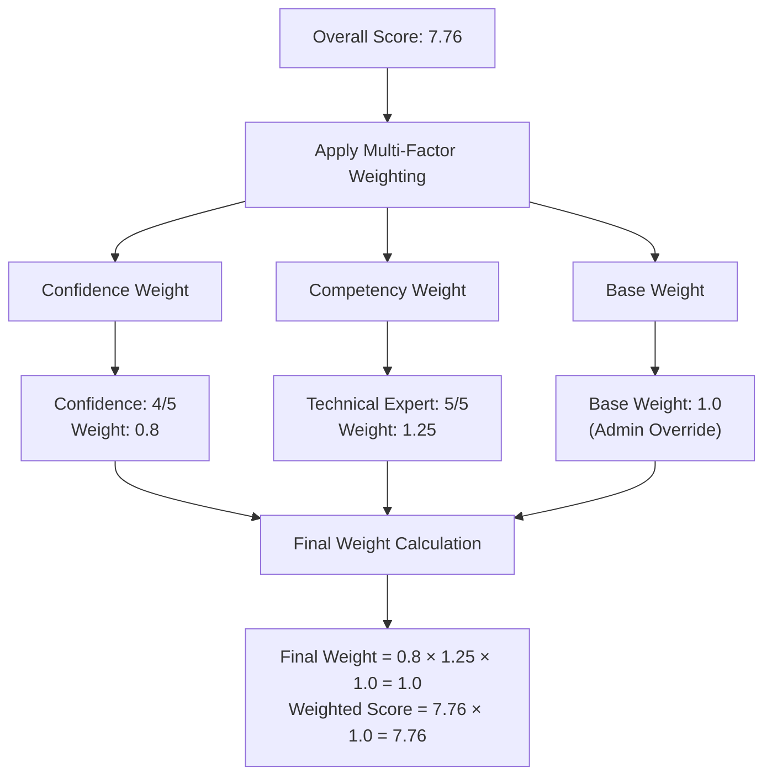
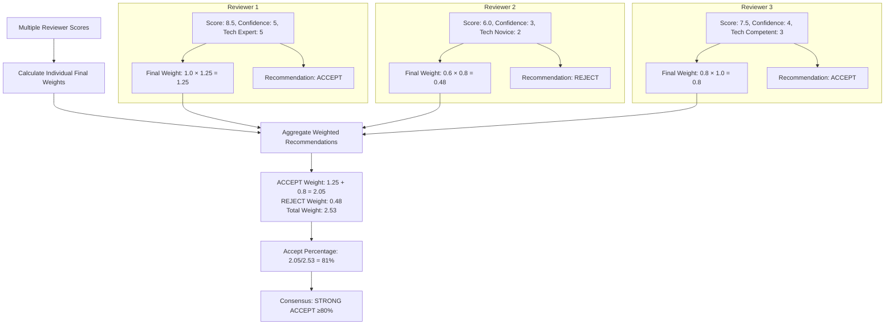

# Enhanced Reviewer Weighting System

## Overview

The enhanced reviewer weighting system provides sophisticated, multi-factor scoring that combines reviewer confidence levels with admin-assigned competency ratings to create more accurate consensus decisions. This system ensures that expert reviewers in specific domains have appropriate influence while maintaining fairness and transparency.

## Architecture Overview



## Competency System

### Competency Categories

Each reviewer can be assigned competency levels (1-5 scale) across different evaluation categories:

| Category | Description | Example Expertise |
|----------|-------------|-------------------|
| **TECHNICAL** | Technical skills, coding, architecture | Senior developers, CTOs, technical leads |
| **PROJECT** | Project feasibility, roadmaps, execution | Product managers, project leads, entrepreneurs |
| **COMMUNITY_FIT** | Cultural alignment, collaboration | Community managers, long-term ecosystem participants |
| **VIDEO** | Communication assessment, presentation skills | HR professionals, public speaking coaches |
| **OVERALL** | General evaluation competency | Experienced reviewers across domains |

### Competency Levels

| Level | Label | Description | Weight Multiplier |
|-------|--------|-------------|-------------------|
| 1 | Novice | Limited experience in this area | 0.65x |
| 2 | Developing | Some experience, still learning | 0.80x |
| 3 | Competent | Solid experience, reliable assessments | 1.0x (baseline) |
| 4 | Advanced | High expertise, nuanced understanding | 1.15x |
| 5 | Expert | World-class expertise, definitive authority | 1.25x |

## Scoring Algorithm

### Individual Score Calculation



**Formula**: `Overall Score = Σ(Individual Criteria Score × Criteria Weight) / Total Weight`

**Example**:
- Technical Skills (12% weight): 8.5/10
- Project Vision (10% weight): 7.0/10
- Community Fit (8% weight): 9.0/10
- Communication (8% weight): 6.5/10

`Overall Score = (8.5×0.12 + 7.0×0.10 + 9.0×0.08 + 6.5×0.08) / 0.38 = 7.76/10`

### Multi-Factor Weighting



**Multi-Factor Weight Formula**:
```
Final Weight = Confidence Weight × Competency Weight × Base Weight

Confidence Weight = confidence_level / 5
Competency Weight = 0.5 + (competency_level × 0.15)
Base Weight = admin_set_override (default: 1.0)
```

## Consensus Generation

### Weighted Recommendation Calculation



### Consensus Categories

| Category | Accept % | Description |
|----------|----------|-------------|
| **Strong Accept** | ≥ 80% | Clear consensus for acceptance |
| **Lean Accept** | 60-79% | Majority favor acceptance |
| **Mixed Reviews** | 40-59% | No clear consensus |
| **Lean Reject** | 21-39% | Majority favor rejection |
| **Strong Reject** | ≤ 20% | Clear consensus for rejection |

## Testing the System

### 1. **Admin Setup** (Database/API Level)

```bash
# 1. Ensure migrations are applied
bunx prisma migrate dev

# 2. Access admin API to set reviewer competencies
POST /api/trpc/evaluation.setReviewerCompetency
{
  "reviewerId": "reviewer_user_id",
  "category": "TECHNICAL", 
  "competencyLevel": 5,
  "baseWeight": 1.0,
  "notes": "Senior technical lead with 10+ years experience"
}
```

### 2. **Testing Scenarios**

#### Scenario A: Expert vs Novice Technical Review
```json
{
  "expert_reviewer": {
    "competencies": [{"category": "TECHNICAL", "level": 5}],
    "confidence": 5,
    "score": 8.5,
    "recommendation": "ACCEPT",
    "final_weight": 1.25
  },
  "novice_reviewer": {
    "competencies": [{"category": "TECHNICAL", "level": 1}], 
    "confidence": 3,
    "score": 6.0,
    "recommendation": "REJECT",
    "final_weight": 0.39
  }
}
```
**Expected Result**: Expert opinion carries 3.2x more weight → likely ACCEPT

#### Scenario B: Mixed Competency Review
```json
{
  "technical_expert": {
    "competencies": [
      {"category": "TECHNICAL", "level": 5},
      {"category": "VIDEO", "level": 2}
    ]
  },
  "community_expert": {
    "competencies": [
      {"category": "COMMUNITY_FIT", "level": 5},
      {"category": "TECHNICAL", "level": 2}
    ]
  }
}
```
**Expected Result**: Each reviewer's influence varies by evaluation category

### 3. **UI Testing**

#### Access Consensus Modal
1. Navigate to admin applications dashboard
2. Select an application with multiple completed reviews
3. Click "View Consensus" 
4. Verify the enhanced display shows:
   - Original vs Weighted scores
   - Weight breakdown (Confidence + Competency + Final)
   - Competency badges in expanded view
   - Updated consensus indicators

#### Key UI Elements to Verify
- **Score Display**: Shows original score → weighted score transformation
- **Weight Breakdown**: Displays confidence%, competency%, and final weight%  
- **Competency Badges**: Color-coded competency levels per category
- **Consensus Indicator**: Uses multi-factor weights for consensus calculation

### 4. **API Testing Endpoints**

```bash
# Get reviewer competencies
GET /api/trpc/evaluation.getReviewerCompetencies?reviewerId=user_id

# Set bulk competencies
POST /api/trpc/evaluation.bulkSetReviewerCompetencies
{
  "reviewerId": "user_id",
  "competencies": [
    {"category": "TECHNICAL", "competencyLevel": 5},
    {"category": "PROJECT", "competencyLevel": 4},
    {"category": "COMMUNITY_FIT", "competencyLevel": 3}
  ]
}

# Get all reviewers with competencies (admin only)
GET /api/trpc/evaluation.getAllReviewersWithCompetencies

# Get consensus data (includes competencies)
GET /api/trpc/evaluation.getConsensusData?applicationId=app_id
```

## Implementation Files

| Component | File Location | Purpose |
|-----------|---------------|---------|
| **Database Schema** | `prisma/schema.prisma` | ReviewerCompetency model definition |
| **Weighting Algorithm** | `src/utils/confidenceWeighting.ts` | Multi-factor weight calculations |
| **API Endpoints** | `src/server/api/routers/evaluation.ts` | Competency management APIs |
| **UI Components** | `src/app/_components/ConsensusModal.tsx` | Enhanced consensus display |
| **Migration** | `prisma/migrations/20250911190511_add_reviewer_competency_system/` | Database schema changes |

## Migration Information

**Migration Name**: `20250911190511_add_reviewer_competency_system`
**Status**: ✅ Applied
**Tables Added**: `ReviewerCompetency`
**Indexes Added**: 3 (reviewerId, category, competencyLevel)
**Constraints**: Unique constraint on (reviewerId, category)

## Benefits

### 1. **More Accurate Consensus**
- Expert reviewers have appropriate influence in their domains
- Reduces impact of inexperienced reviewers outside their expertise
- Maintains democratic process while recognizing expertise differences

### 2. **Transparency**
- Clear display of how weights are calculated
- Visible competency levels for each reviewer
- Audit trail of who assigned competencies and when

### 3. **Flexibility** 
- Admin-configurable competency levels
- Category-specific expertise recognition
- Manual weight overrides for special cases

### 4. **Backward Compatibility**
- Existing reviews continue to work with confidence-only weighting
- Gradual migration as competencies are assigned
- No disruption to current processes

## Future Enhancements

1. **Auto-Competency Detection**: ML-based competency level suggestions based on review history
2. **Dynamic Weight Adjustment**: Competency levels that evolve based on review accuracy
3. **Specialized Categories**: Additional competency categories for specific event types
4. **Cross-Event Learning**: Competency levels that transfer across different events
5. **Reviewer Analytics**: Dashboard showing reviewer performance and competency trends