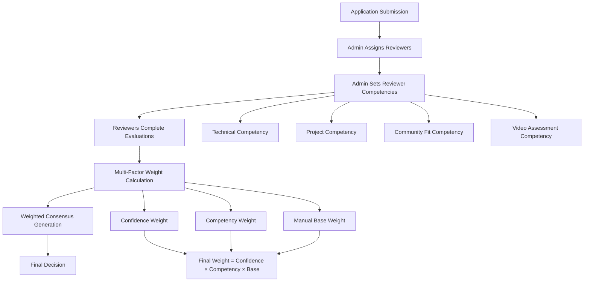
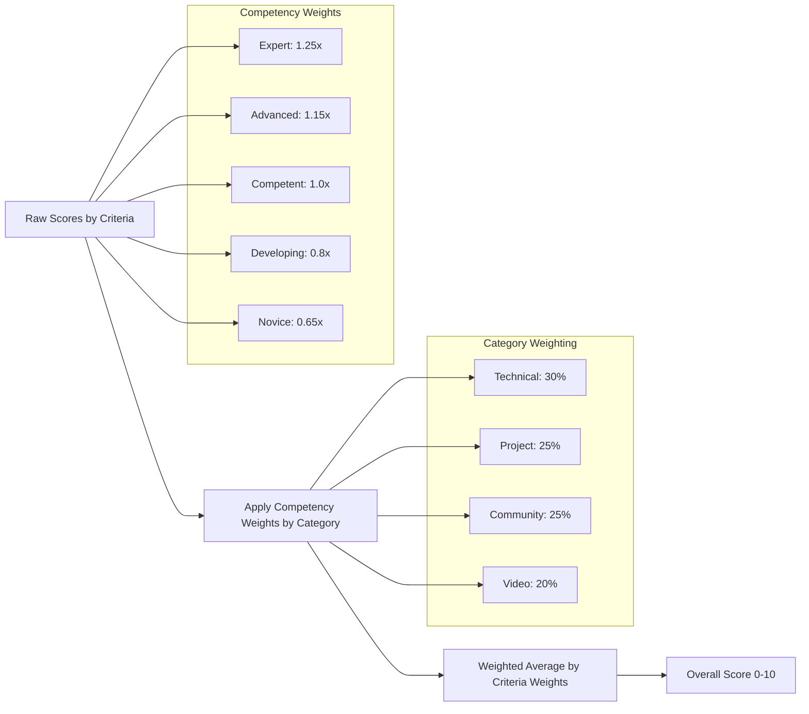
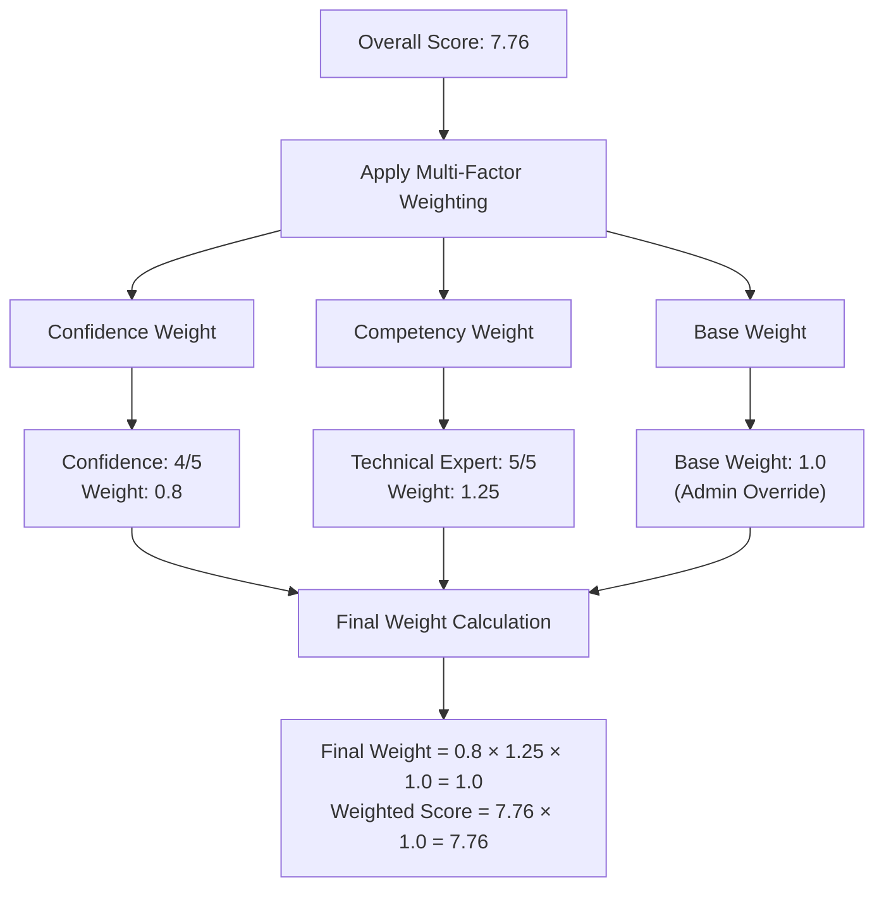
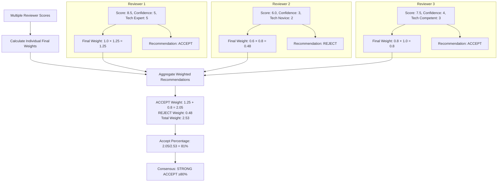

# Enhanced Reviewer Weighting System

## Overview

The enhanced reviewer weighting system provides sophisticated, multi-factor scoring that combines reviewer confidence levels with admin-assigned competency ratings to create more accurate consensus decisions. This system ensures that expert reviewers in specific domains have appropriate influence while maintaining fairness and transparency.

## Architecture Overview



## Competency System

### Competency Categories

Each reviewer can be assigned competency levels (1-5 scale) across different evaluation categories:

| Category | Description | Example Expertise |
|----------|-------------|-------------------|
| **TECHNICAL** | Technical skills, coding, architecture | Senior developers, CTOs, technical leads |
| **PROJECT** | Project feasibility, roadmaps, execution | Product managers, project leads, entrepreneurs |
| **COMMUNITY_FIT** | Cultural alignment, collaboration | Community managers, long-term ecosystem participants |
| **VIDEO** | Communication assessment, presentation skills | HR professionals, public speaking coaches |
| **OVERALL** | General evaluation competency | Experienced reviewers across domains |

### Competency Levels

| Level | Label | Description | Weight Multiplier |
|-------|--------|-------------|-------------------|
| 1 | Novice | Limited experience in this area | 0.65x |
| 2 | Developing | Some experience, still learning | 0.80x |
| 3 | Competent | Solid experience, reliable assessments | 1.0x (baseline) |
| 4 | Advanced | High expertise, nuanced understanding | 1.15x |
| 5 | Expert | World-class expertise, definitive authority | 1.25x |

## Competency-to-Criteria Mapping

### How Reviewer Competencies Apply to Individual Evaluation Criteria

Each reviewer rates applications on **12 specific evaluation criteria** (the "star things" they click during review). Their competency level in each **category** determines the weight of their ratings for criteria within that category.

### Current Evaluation Criteria Structure

**Technical Category (30% total weight):**
- Technical Skills Assessment (12%)
- Open Source & Collaborative Experience (10%) 
- Learning & Adaptation Ability (8%)

**Project Category (25% total weight):**
- Project Vision & Feasibility (10%)
- Public Goods & RealFi Alignment (8%)
- Impact Potential & Measurement Understanding (7%)

**Community Fit Category (25% total weight):**
- Public Goods Ecosystem Understanding (8%)
- Community Contribution Potential (9%)
- Commitment & Availability (8%)

**Video Category (20% total weight):**
- Communication Skills (8%)
- Passion & Authenticity (7%)
- Professionalism & Presentation (5%)

### Competency Weight Application

When a reviewer rates any evaluation criterion, the system applies their competency weight for that criterion's **category**:

```typescript
// Simplified weight calculation
const getCriterionWeight = (reviewer, evaluationCriterion) => {
  // Find reviewer's competency in this criterion's category
  const relevantCompetency = reviewer.competencies.find(
    comp => comp.category === evaluationCriterion.category
  );
  
  // Calculate competency weight: 0.5 + (level × 0.15)
  const competencyWeight = relevantCompetency 
    ? 0.5 + (relevantCompetency.competencyLevel * 0.15)
    : 1.0; // Default if no competency set
    
  return competencyWeight;
}
```

### Practical Examples

**Technical Expert (TECHNICAL competency level 5)**
- Rating "Technical Skills Assessment" → Gets 1.25x weight
- Rating "Open Source Experience" → Gets 1.25x weight  
- Rating "Learning & Adaptation" → Gets 1.25x weight
- Rating "Communication Skills" → Gets 1.0x weight (no VIDEO competency)
- Rating "Project Vision" → Gets 1.0x weight (no PROJECT competency)

**Community Manager (COMMUNITY_FIT competency level 4)**
- Rating "Ecosystem Understanding" → Gets 1.15x weight
- Rating "Community Contribution" → Gets 1.15x weight
- Rating "Commitment & Availability" → Gets 1.15x weight
- Rating "Technical Skills" → Gets 1.0x weight (no TECHNICAL competency)
- Rating "Video Communication" → Gets 1.0x weight (no VIDEO competency)

**Generalist Reviewer (OVERALL competency level 3)**
- All criterion ratings → Get 1.0x weight (baseline)
- Provides balanced perspective across all categories

## How Reviewers Experience the System

### The Review Process

1. **Reviewer opens application** for evaluation
2. **Sees 12 evaluation criteria** to rate on 1-10 scale (star ratings)
3. **Rates each criterion** based on their assessment
4. **System applies competency weights** automatically behind the scenes
5. **Weighted scores contribute** to consensus calculation

### What Reviewers See vs What Happens

**Reviewer Interface:**
```
□ Technical Skills Assessment     [★★★★★★★★☆☆] (8/10)
□ Open Source Experience          [★★★★★★★☆☆☆] (7/10)
□ Communication Skills            [★★★★★★☆☆☆☆] (6/10)
```

**Behind the Scenes (Technical Expert with TECHNICAL=5):**
```
□ Technical Skills: 8.0 × 1.25 = 10.0 weighted points
□ Open Source: 7.0 × 1.25 = 8.75 weighted points  
□ Communication: 6.0 × 1.0 = 6.0 weighted points
```

### Multi-Domain Expert Example

**Reviewer with TECHNICAL=5 and VIDEO=4 competencies:**
- Technical criteria → Get 1.25x weight (expert level)
- Video criteria → Get 1.15x weight (advanced level)
- Project criteria → Get 1.0x weight (no competency)
- Community criteria → Get 1.0x weight (no competency)

## Weight Application Process

### Technical Implementation

```typescript
// For each evaluation criterion the reviewer rates
function calculateWeightedScore(reviewer, criterion, rawScore) {
  // 1. Find relevant competency for this criterion's category
  const competency = reviewer.competencies.find(
    comp => comp.category === criterion.category
  );
  
  // 2. Calculate competency weight
  const competencyWeight = competency 
    ? 0.5 + (competency.competencyLevel * 0.15)
    : 1.0;
  
  // 3. Apply weight to raw score
  const weightedScore = rawScore * competencyWeight;
  
  // 4. Also factor in confidence and base weights
  const confidenceWeight = reviewer.confidenceLevel / 5;
  const baseWeight = competency?.baseWeight ?? 1.0;
  
  const finalWeight = confidenceWeight * competencyWeight * baseWeight;
  
  return {
    rawScore,
    weightedScore: rawScore * finalWeight,
    weights: { confidenceWeight, competencyWeight, baseWeight, finalWeight }
  };
}
```

### Category-Level Aggregation

After all criteria within a category are weighted:

```typescript
// Aggregate category score
const categoryScore = (
  Σ(criterion.weightedScore × criterion.weight) / 
  Σ(criterion.weight)
);

// Then combine categories for overall application score
const overallScore = (
  (technicalScore × 0.30) +
  (projectScore × 0.25) + 
  (communityScore × 0.25) +
  (videoScore × 0.20)
);
```

## Scoring Algorithm

### Individual Score Calculation



**Formula**: `Overall Score = Σ(Individual Criteria Score × Criteria Weight) / Total Weight`

**Example**:
- Technical Skills (12% weight): 8.5/10
- Project Vision (10% weight): 7.0/10
- Community Fit (8% weight): 9.0/10
- Communication (8% weight): 6.5/10

`Overall Score = (8.5×0.12 + 7.0×0.10 + 9.0×0.08 + 6.5×0.08) / 0.38 = 7.76/10`

### Multi-Factor Weighting



**Multi-Factor Weight Formula**:
```
Final Weight = Confidence Weight × Competency Weight × Base Weight

Confidence Weight = confidence_level / 5
Competency Weight = 0.5 + (competency_level × 0.15)
Base Weight = admin_set_override (default: 1.0)
```

## Consensus Generation

### Weighted Recommendation Calculation



### Consensus Categories

| Category | Accept % | Description |
|----------|----------|-------------|
| **Strong Accept** | ≥ 80% | Clear consensus for acceptance |
| **Lean Accept** | 60-79% | Majority favor acceptance |
| **Mixed Reviews** | 40-59% | No clear consensus |
| **Lean Reject** | 21-39% | Majority favor rejection |
| **Strong Reject** | ≤ 20% | Clear consensus for rejection |

## Testing the System

### 1. **Admin Setup** (Database/API Level)

```bash
# 1. Ensure migrations are applied
bunx prisma migrate dev

# 2. Access admin API to set reviewer competencies
POST /api/trpc/evaluation.setReviewerCompetency
{
  "reviewerId": "reviewer_user_id",
  "category": "TECHNICAL", 
  "competencyLevel": 5,
  "baseWeight": 1.0,
  "notes": "Senior technical lead with 10+ years experience"
}
```

### 2. **Testing Scenarios**

#### Scenario A: Expert vs Novice Technical Review
```json
{
  "expert_reviewer": {
    "competencies": [{"category": "TECHNICAL", "level": 5}],
    "confidence": 5,
    "score": 8.5,
    "recommendation": "ACCEPT",
    "final_weight": 1.25
  },
  "novice_reviewer": {
    "competencies": [{"category": "TECHNICAL", "level": 1}], 
    "confidence": 3,
    "score": 6.0,
    "recommendation": "REJECT",
    "final_weight": 0.39
  }
}
```
**Expected Result**: Expert opinion carries 3.2x more weight → likely ACCEPT

#### Scenario B: Mixed Competency Review
```json
{
  "technical_expert": {
    "competencies": [
      {"category": "TECHNICAL", "level": 5},
      {"category": "VIDEO", "level": 2}
    ]
  },
  "community_expert": {
    "competencies": [
      {"category": "COMMUNITY_FIT", "level": 5},
      {"category": "TECHNICAL", "level": 2}
    ]
  }
}
```
**Expected Result**: Each reviewer's influence varies by evaluation category

### 3. **UI Testing**

#### Access Consensus Modal
1. Navigate to admin applications dashboard
2. Select an application with multiple completed reviews
3. Click "View Consensus" 
4. Verify the enhanced display shows:
   - Original vs Weighted scores
   - Weight breakdown (Confidence + Competency + Final)
   - Competency badges in expanded view
   - Updated consensus indicators

#### Key UI Elements to Verify
- **Score Display**: Shows original score → weighted score transformation
- **Weight Breakdown**: Displays confidence%, competency%, and final weight%  
- **Competency Badges**: Color-coded competency levels per category
- **Consensus Indicator**: Uses multi-factor weights for consensus calculation

### 4. **API Testing Endpoints**

```bash
# Get reviewer competencies
GET /api/trpc/evaluation.getReviewerCompetencies?reviewerId=user_id

# Set bulk competencies
POST /api/trpc/evaluation.bulkSetReviewerCompetencies
{
  "reviewerId": "user_id",
  "competencies": [
    {"category": "TECHNICAL", "competencyLevel": 5},
    {"category": "PROJECT", "competencyLevel": 4},
    {"category": "COMMUNITY_FIT", "competencyLevel": 3}
  ]
}

# Get all reviewers with competencies (admin only)
GET /api/trpc/evaluation.getAllReviewersWithCompetencies

# Get consensus data (includes competencies)
GET /api/trpc/evaluation.getConsensusData?applicationId=app_id
```

## Implementation Files

| Component | File Location | Purpose |
|-----------|---------------|---------|
| **Database Schema** | `prisma/schema.prisma` | ReviewerCompetency model definition |
| **Weighting Algorithm** | `src/utils/confidenceWeighting.ts` | Multi-factor weight calculations |
| **API Endpoints** | `src/server/api/routers/evaluation.ts` | Competency management APIs |
| **UI Components** | `src/app/_components/ConsensusModal.tsx` | Enhanced consensus display |
| **Migration** | `prisma/migrations/20250911190511_add_reviewer_competency_system/` | Database schema changes |

## Migration Information

**Migration Name**: `20250911190511_add_reviewer_competency_system`
**Status**: ✅ Applied
**Tables Added**: `ReviewerCompetency`
**Indexes Added**: 3 (reviewerId, category, competencyLevel)
**Constraints**: Unique constraint on (reviewerId, category)

## Benefits

### 1. **More Accurate Consensus**
- Expert reviewers have appropriate influence in their domains
- Reduces impact of inexperienced reviewers outside their expertise
- Maintains democratic process while recognizing expertise differences

### 2. **Transparency**
- Clear display of how weights are calculated
- Visible competency levels for each reviewer
- Audit trail of who assigned competencies and when

### 3. **Flexibility** 
- Admin-configurable competency levels
- Category-specific expertise recognition
- Manual weight overrides for special cases

### 4. **Backward Compatibility**
- Existing reviews continue to work with confidence-only weighting
- Gradual migration as competencies are assigned
- No disruption to current processes

## Real-World Scenarios

### Scenario 1: Technical Project Review

**Application:** Blockchain infrastructure project
**Reviewers:**
- Alice (TECHNICAL=5, Expert): Technical architect with 10+ years
- Bob (COMMUNITY_FIT=4, Advanced): Community manager 
- Carol (OVERALL=3, Competent): General reviewer

**Review Results:**
```
Technical Skills Assessment:
- Alice: 9/10 × 1.25 = 11.25 weighted points
- Bob: 6/10 × 1.0 = 6.0 weighted points  
- Carol: 7/10 × 1.0 = 7.0 weighted points
→ Expert technical opinion heavily influences technical assessment

Community Contribution Potential:
- Alice: 5/10 × 1.0 = 5.0 weighted points
- Bob: 9/10 × 1.15 = 10.35 weighted points
- Carol: 7/10 × 1.0 = 7.0 weighted points  
→ Community expert's assessment carries more weight here
```

### Scenario 2: Cross-Domain Expert

**Reviewer:** David with TECHNICAL=5 and VIDEO=4 competencies
**When reviewing any application:**
- Technical criteria → 1.25x weight (world-class expertise)
- Video criteria → 1.15x weight (advanced expertise)
- Project criteria → 1.0x weight (baseline)
- Community criteria → 1.0x weight (baseline)

**Impact:** David's technical and communication assessments carry extra weight, while his project feasibility and community fit evaluations are weighted normally.

### Scenario 3: Generalist vs Specialist Consensus

**High-stakes technical project review:**
- 3 Generalist reviewers (OVERALL=3): Each vote counts as 1.0x
- 1 Technical expert (TECHNICAL=5): Vote counts as 1.25x
- 1 Project expert (PROJECT=5): Vote counts as 1.25x for project criteria

**Result:** Specialists' domain expertise appropriately influences the final decision while maintaining democratic participation.

## RealFi Integration Readiness

### Current System Strengths
- **Flexible category system** can accommodate new competency domains
- **Multi-factor weighting** already supports domain-specific expertise
- **Database schema** designed for extensibility
- **UI framework** can handle additional competency categories

### Current Limitations for RealFi

The existing 5 competency categories are **general-purpose** but don't capture the **specific RealFi focus domains**:

**Current Categories:**
- TECHNICAL (broad technical skills)
- PROJECT (general project assessment)
- COMMUNITY_FIT (general community alignment)
- VIDEO (communication skills)
- OVERALL (general evaluation)

**RealFi Focus Domains Not Captured:**
- **Secure Communications** expertise (Tor, Nym, censorship resistance)
- **Decentralized Identity** knowledge (DIDs, ZK proofs, credentials)
- **Confidential Compute** experience (ZK, MPC, FHE, privacy AI)
- **Funding & Governance** understanding (quadratic funding, retroPGF)

### Migration Path for RealFi Integration

**Phase 1: Extend Competency Categories**
```prisma
enum CriteriaCategory {
  TECHNICAL
  PROJECT  
  COMMUNITY_FIT
  VIDEO
  OVERALL
  // New RealFi-specific categories
  SECURE_COMMUNICATIONS     
  DECENTRALIZED_IDENTITY    
  CONFIDENTIAL_COMPUTE      
  FUNDING_GOVERNANCE        
}
```

**Phase 2: Domain-Specific Evaluation Criteria**
- Add evaluation criteria targeting each RealFi domain
- Maintain existing general criteria (60% weight)
- Add RealFi-specific criteria (40% weight)

**Phase 3: Expert Reviewer Assignment**
- Cryptography experts → High CONFIDENTIAL_COMPUTE competency
- Privacy protocol developers → High SECURE_COMMUNICATIONS competency  
- DID specialists → High DECENTRALIZED_IDENTITY competency
- Governance researchers → High FUNDING_GOVERNANCE competency

**Phase 4: Enhanced Consensus**
- Applications targeting specific domains get expert review
- Domain experts have increased influence in their areas
- Cross-domain projects benefit from multiple specialist perspectives

**Benefits for RealFi Applications:**
1. **Qualified Assessment:** Cryptography projects reviewed by crypto experts
2. **Domain Coverage:** Each focus area has dedicated expert evaluation
3. **Practical Focus:** "Building with friction in mind" gets proper assessment
4. **Expert Recognition:** Specialists in emerging fields get appropriate weight

## Future Enhancements

1. **RealFi Domain Integration**: Add the four focus domain competencies as outlined above
2. **Auto-Competency Detection**: ML-based competency level suggestions based on review history
3. **Dynamic Weight Adjustment**: Competency levels that evolve based on review accuracy
4. **Cross-Event Learning**: Competency levels that transfer across different events
5. **Reviewer Analytics**: Dashboard showing reviewer performance and competency trends
6. **Domain-Specific Metrics**: Track consensus quality and expert coverage by RealFi domain