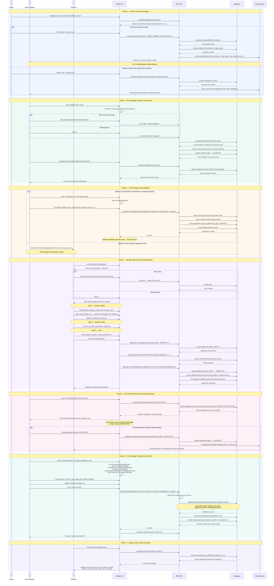

# Speaker Session Workflow - Sequence Diagram

```mermaid
sequenceDiagram
    actor Admin
    actor FloorMgr as Floor Manager
    actor Speaker
    participant Platform as Platform UI
    participant API as tRPC API
    participant DB as Database
    participant Email as Email Service

    %% ═══════════════════════════════════════════
    %% PHASE 1: Admin Invites Floor Manager
    %% ═══════════════════════════════════════════

    rect rgb(59, 130, 246, 0.08)
    note over Admin, Email: Phase 1 — Admin Invites Floor Manager

    Admin->>Platform: Navigate to /admin/events/[eventId]/floor-owners
    Platform->>API: schedule.getMyFloors({ eventId })
    API-->>Platform: Return venues (Main Stage, Workshop Room A, etc.)

    alt Invite by Email (new user)
        Admin->>Platform: Enter email + select venue
        Platform->>API: invitation.create({ email, type: "VENUE_OWNER", eventId, venueId })
        API->>DB: Check for existing PENDING invitation
        DB-->>API: No duplicate found
        API->>DB: Create Invitation record (token, 30-day expiry)
        DB-->>API: Invitation created
        API->>Email: sendInvitationEmail({ email, roleName: "Floor Lead - Main Stage", token })
        Email-->>FloorMgr: Email with "Accept Invitation" button
        Note over Email, FloorMgr: Link: /events/{slug}?invitation={token}
    else Assign Existing User (already has account)
        Admin->>Platform: Search user + select venue
        Platform->>API: schedule.assignVenueOwner({ userId, venueId, eventId })
        API->>DB: Create VenueOwner record
        DB-->>API: VenueOwner created
        API->>Email: Send "You've been assigned as Floor Lead" notification
        Email-->>FloorMgr: Notification email with link to manage-schedule
    end
    end

    %% ═══════════════════════════════════════════
    %% PHASE 2: Floor Manager Accepts Invitation
    %% ═══════════════════════════════════════════

    rect rgb(16, 185, 129, 0.08)
    note over Admin, Email: Phase 2 — Floor Manager Accepts & Gets Access

    FloorMgr->>Platform: Click invitation link in email
    Platform->>Platform: Redirect to event page with ?invitation={token}

    alt New User (no account)
        FloorMgr->>Platform: Sign up (Discord OAuth / Email+Password)
        Platform->>API: Auth sign-in callback triggered
    else Existing User
        FloorMgr->>Platform: Sign in
        Platform->>API: Auth sign-in callback triggered
    end

    API->>DB: acceptPendingInvitations(email, userId)
    DB-->>API: Find PENDING invitation with matching email
    API->>DB: Create VenueOwner({ userId, venueId, eventId })
    API->>DB: Update Invitation status → ACCEPTED
    DB-->>API: Floor Manager now owns venue

    FloorMgr->>Platform: Navigate to /events/[eventId]/manage-schedule
    Platform->>API: schedule.getMyFloors({ eventId })
    API->>DB: Query VenueOwner where userId = Floor Manager
    DB-->>API: Return assigned venues
    API-->>Platform: Venues with session counts
    Platform-->>FloorMgr: Show floor management dashboard
    end

    %% ═══════════════════════════════════════════
    %% PHASE 3: Floor Manager Invites Speaker
    %% ═══════════════════════════════════════════

    rect rgb(245, 158, 11, 0.08)
    note over Admin, Email: Phase 3 — Floor Manager Invites Speaker

    alt Option A: Add Speaker On Behalf (from manage-schedule)
        FloorMgr->>Platform: Click "Add Speaker" on manage-schedule
        Platform->>Platform: Open AddSpeakerModal
        FloorMgr->>Platform: Fill speaker details (name, email, talk title, abstract, format, etc.)
        Platform->>API: application.createSpeakerOnBehalf({ email, firstName, sessionDetails, venueIds })
        API->>DB: Find or create User record for speaker email
        API->>DB: Upsert UserProfile with speaker fields
        API->>DB: Create Application (status: SUBMITTED, type: SPEAKER)
        API->>DB: Create ApplicationVenue links
        DB-->>API: Application created
        API-->>Platform: Success
        Note over Platform: Speaker application already exists — skip to Phase 5
    else Option B: Share Speaker Application Link
        FloorMgr-->>Speaker: Share link: /events/{slug}/speaker (verbal, email, message, etc.)
        Note over FloorMgr, Speaker: Floor Manager tells speaker to apply
    end
    end

    %% ═══════════════════════════════════════════
    %% PHASE 4: Speaker Creates Account & Applies
    %% ═══════════════════════════════════════════

    rect rgb(168, 85, 247, 0.08)
    note over Admin, Email: Phase 4 — Speaker Signs Up & Submits Application

    Speaker->>Platform: Visit /events/[eventId]/speaker
    Platform-->>Speaker: Show auth gate (Sign In / Sign Up)

    alt New User
        Speaker->>Platform: Create account (Discord OAuth / Email+Password)
        Platform->>API: Auth flow → create User record
        API->>DB: Create User
        DB-->>API: User created
    else Existing User
        Speaker->>Platform: Sign in
    end

    Platform-->>Speaker: Show SpeakerApplicationForm (3 steps)

    Note over Speaker, Platform: Step 1 — Session Details
    Speaker->>Platform: Enter talk title, abstract, session type, duration, topic
    Speaker->>Platform: Select "Who invited you?" → picks Floor Manager from dropdown
    Speaker->>Platform: Select venue/floor to present at

    Note over Speaker, Platform: Step 2 — Speaker Profile
    Speaker->>Platform: Enter bio, job title, organization, experience

    Note over Speaker, Platform: Step 3 — Links
    Speaker->>Platform: Enter website, LinkedIn, Twitter, past talk URL

    Speaker->>Platform: Click "Submit Application"

    Platform->>API: application.createApplication({ eventId, type: "SPEAKER" })
    API->>DB: Create Application (status: DRAFT)
    DB-->>API: Application ID returned

    Platform->>API: profile.updateProfile({ speakerTalkTitle, speakerTalkAbstract, ... })
    API->>DB: Upsert UserProfile with all speaker fields
    DB-->>API: Profile updated

    Platform->>API: application.submitApplication({ applicationId, venueIds, speakerInvitedByUserId })
    API->>DB: Update Application status: DRAFT → SUBMITTED
    API->>DB: Create ApplicationVenue records (links speaker to selected floors)
    API->>DB: Set speakerInvitedByUserId (tracks who invited them)
    DB-->>API: Application submitted
    Platform-->>Speaker: "Application submitted successfully!"
    end

    %% ═══════════════════════════════════════════
    %% PHASE 5: Floor Manager Reviews Application
    %% ═══════════════════════════════════════════

    rect rgb(236, 72, 153, 0.08)
    note over Admin, Email: Phase 5 — Floor Manager Reviews & Accepts Application

    FloorMgr->>Platform: Open /events/[eventId]/manage-schedule
    Platform->>API: schedule.getFloorApplications({ eventId, venueId })
    API->>DB: Query Applications where venueId match AND status IN (SUBMITTED, ACCEPTED)
    DB-->>API: Return applications with user profiles
    API-->>Platform: Speaker's application with talk details

    Platform-->>FloorMgr: Show FloorApplicationsList with speaker's card
    Note over Platform: Card shows: name, talk title, format badge,<br/>duration, status (SUBMITTED)

    opt Accept Application (optional separate step)
        FloorMgr->>Platform: Update application status to ACCEPTED
        Platform->>API: application.updateApplicationStatus({ applicationId, status: "ACCEPTED" })
        API->>DB: Update Application.status → ACCEPTED
        API->>Email: sendApplicationStatusEmail(application, "ACCEPTED")
        Email-->>Speaker: "Congratulations! Your application has been accepted"
    end
    end

    %% ═══════════════════════════════════════════
    %% PHASE 6: Floor Manager Creates Session
    %% ═══════════════════════════════════════════

    rect rgb(20, 184, 166, 0.08)
    note over Admin, Email: Phase 6 — Floor Manager Schedules the Session

    FloorMgr->>Platform: Click "Create Session" on speaker's application card

    Platform->>Platform: Pre-fill CreateSessionModal with:<br/>• title from speakerTalkTitle<br/>• description from speakerTalkAbstract<br/>• speaker auto-selected<br/>• sessionType matched from speakerTalkFormat<br/>• track matched from speakerTalkTopic

    FloorMgr->>Platform: Set start time, end time, room (adjust other fields if needed)
    FloorMgr->>Platform: Toggle "Published" (default: on)
    FloorMgr->>Platform: Click "Create Session"

    Platform->>API: schedule.createSession({ eventId, title, startTime, endTime, linkedSpeakers, venueId, ... })

    API->>API: Verify floor manager owns this venue
    API->>DB: validateSpeakersAreFloorApplicants(venueId, speakerUserIds)
    Note over API, DB: Non-admin check: speaker must have<br/>applied for this floor via ApplicationVenue
    DB-->>API: Validation passed

    API->>DB: Create ScheduleSession (isPublished: true)
    API->>DB: Create SessionSpeaker({ sessionId, userId, role: "Speaker" })
    DB-->>API: Session created with speaker linked

    API-->>Platform: Success
    Platform->>API: Invalidate schedule queries (refresh UI)
    Platform-->>FloorMgr: "Session created successfully!"
    end

    %% ═══════════════════════════════════════════
    %% PHASE 7: Session Visible on Public Schedule
    %% ═══════════════════════════════════════════

    rect rgb(99, 102, 241, 0.08)
    note over Admin, Email: Phase 7 — Session Live on Public Schedule

    Speaker->>Platform: Visit /events/[eventId]/schedule
    Platform->>API: schedule.getEventSchedule({ eventId })
    API->>DB: Query ScheduleSessions WHERE isPublished = true
    DB-->>API: Return published sessions with speakers
    API-->>Platform: Full event schedule

    Platform-->>Speaker: Speaker sees their session on the public schedule<br/>with their name, talk title, time, room, and track
    end
```
